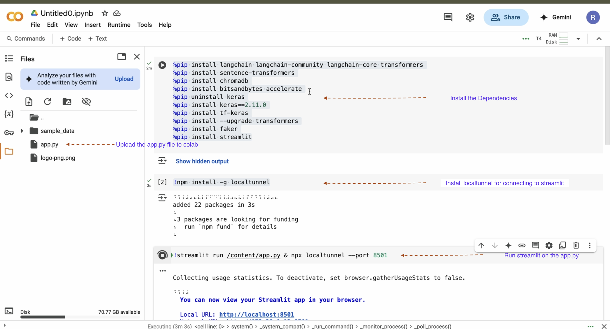

# 🚀 Project Name

## 📌 Table of Contents
- [Introduction](#introduction)
- [Demo](#demo)
- [Inspiration](#inspiration)
- [What It Does](#what-it-does)
- [How We Built It](#how-we-built-it)
- [Challenges We Faced](#challenges-we-faced)
- [How to Run](#how-to-run)
- [Tech Stack](#tech-stack)

---

## Introduction
This project aims to build an enterprise-grade Personalization and Recommendation System powered by LLMs (Large Language Models). The system will leverage customer profiles, social media sentiments, and transaction history to deliver highly personalized recommendations. It will integrate vector databases for efficient similarity searches and real-time processing for instant insights. The solution is designed for enterprise-scale deployment, ensuring robustness, scalability, and seamless integration into existing banking or financial ecosystems.

## 🎥 Demo
📹 [Video Demo](#) https://github.com/ewfx/aidhp-perzonix/releases/download/V1.0/final_video.mov

🖼️ Screenshots:


## 💡 Inspiration
The inspiration for this project comes from the growing need for hyper-personalized customer experiences in the financial sector. With increasing digital interactions, customers expect tailored recommendations, insights, and financial guidance based on their preferences, behaviors, and spending patterns.

## ⚙️ What It Does
The Enterprise-Grade Personalization and Recommendation System analyzes customer profiles, social media sentiments, and transaction history to deliver real-time, AI-driven recommendations tailored to individual users.

## 🛠️ How We Built It
This Enterprise-Grade Personalization and Recommendation System leverages a combination of LLMs (Large Language Models), vector databases, real-time processing frameworks, and Retrieval-Augmented Generation (RAG) to provide highly accurate and context-aware recommendations.

## 🚧 Challenges We Faced
Large-Scale Data Processing → Efficient storage and retrieval of vast customer datasets.
AI Model Optimization → Zephyr-7B required GPU acceleration and tuning for real-time performance.
Vector Database Performance → Optimizing ChromaDB for fast and scalable embeddings retrieval.
Complex Sentiment Analysis → Extracting insights from unstructured, slang-heavy social media data.
Privacy & Compliance → Balancing personalization while ensuring financial data privacy (e.g., GDPR).
UI & Performance → Keeping the Streamlit app responsive with real-time recommendations.

## 🏃 How to Run
1. Clone the repository  
   ```sh
   git clone git@github.com:ewfx/aidhp-perzonix.git
   ```
2. Go to Google Colab as we can leverage the GPU
   https://colab.research.google.com

2. Install dependencies in colab


3. Run the project  


## 🏗️ Tech Stack
- 🔹 Frontend: streamlit
- 🔹 Machine Learning: HuggingFace, CUDA, Transformers
