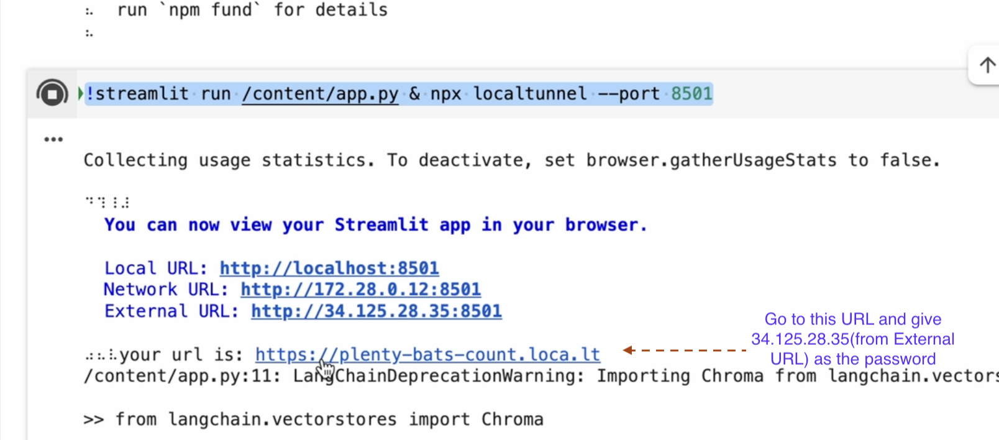
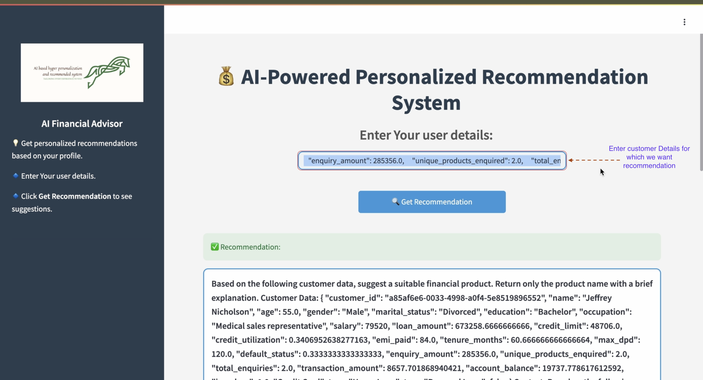
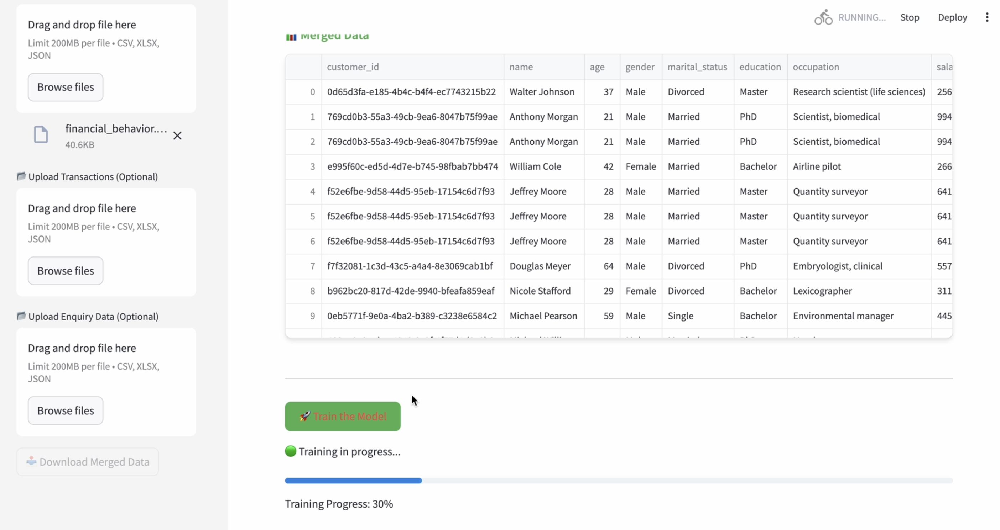

# Hyper-Personaization and Recommendation System(Perzonix)

## Table of Contents
- [Introduction](#introduction)
- [Demo](#demo)
- [Inspiration](#inspiration)
- [What It Does](#what-it-does)
- [How We Built It](#how-we-built-it)
- [Challenges We Faced](#challenges-we-faced)
- [Steps for Execution](#Steps-for-Execution)
- [Steps for Test Execution](#Steps-for-Test-Execution)
- [Tech Stack](#tech-stack)

---

## Introduction
This project aims to build an enterprise-grade Personalization and Recommendation System powered by LLMs (Large Language Models). The system will leverage customer profiles, social media sentiments, and transaction history to deliver highly personalized recommendations. It will integrate vector databases for efficient similarity searches and real-time processing for instant insights. The solution is designed for enterprise-scale deployment, ensuring robustness, scalability, and seamless integration into existing banking or financial ecosystems.

## Demo
📹 [Video Demo](#) https://github.com/ewfx/aidhp-perzonix/releases/download/V1.0/final_video.mov

## Inspiration
The inspiration for this project comes from the growing need for hyper-personalized customer experiences in the financial sector. With increasing digital interactions, customers expect tailored recommendations, insights, and financial guidance based on their preferences, behaviors, and spending patterns.

## What It Does
The Enterprise-Grade Personalization and Recommendation System analyzes customer profiles, social media sentiments, and transaction history to deliver real-time, AI-driven recommendations tailored to individual users.

## How We Built It
This Enterprise-Grade Personalization and Recommendation System leverages a combination of LLMs (Large Language Models), vector databases, real-time processing frameworks, and Retrieval-Augmented Generation (RAG) to provide highly accurate and context-aware recommendations.

## Challenges We Faced
Large-Scale Data Processing → Efficient storage and retrieval of vast customer datasets.
AI Model Optimization → Zephyr-7B required GPU acceleration and tuning for real-time performance.
Vector Database Performance → Optimizing ChromaDB for fast and scalable embeddings retrieval.
Complex Sentiment Analysis → Extracting insights from unstructured, slang-heavy social media data.
Privacy & Compliance → Balancing personalization while ensuring financial data privacy (e.g., GDPR).
UI & Performance → Keeping the Streamlit app responsive with real-time recommendations.

## Steps for Execution
1. Clone the repository  
   ```sh
   git clone git@github.com:ewfx/aidhp-perzonix.git
   ```
2. Go to Google Colab as we can leverage the GPU
   https://colab.research.google.com

3. Install dependencies in colab
   ```sh
   %pip install langchain langchain-community langchain-core transformers
   %pip install sentence-transformers
   %pip install chromadb
   %pip install bitsandbytes accelerate
   %pip uninstall -y keras
   %pip install keras==2.11.0
   %pip install tf-keras
   %pip install --upgrade transformers
   %pip install faker
   %pip install streamlit
   ```

   ```sh
   !npm install -g localtunnel
   ```

   Run the app.py in streamlit
   ```sh
   !streamlit run /content/app.py & npx localtunnel --port 8501
   ```
   Open the External URL to streamlit UI as below,



4. Upload app.py and logo-png.png files to colab

5. Run the project  


## Steps for Test Execution

### To test app.py

  1. Go to Google Colab
     https://colab.research.google.com
     
     Install dependencies in colab

     !pip install pytest
     
  2. Upload the appTest.py file to the same location where you uploaded app.py
  3. Run !pytest appTest.py

     

### To test trainApp.py

   1. Go to Google Colab
      https://colab.research.google.com
     
      Install dependencies in colab

      !pip install pytest
     
  2. Upload the trainAppTest.py file to the same location where you uploaded train.py
  3. Run !pytest trainAppTest.py

     
     
## Future Development
As part of future development, we plan to train the model within this UI by integrating data from multiple sources.


## Tech Stack
- 🔹 Frontend: streamlit
- 🔹 Machine Learning: HuggingFace, CUDA,
         Langchain, Chromadb
